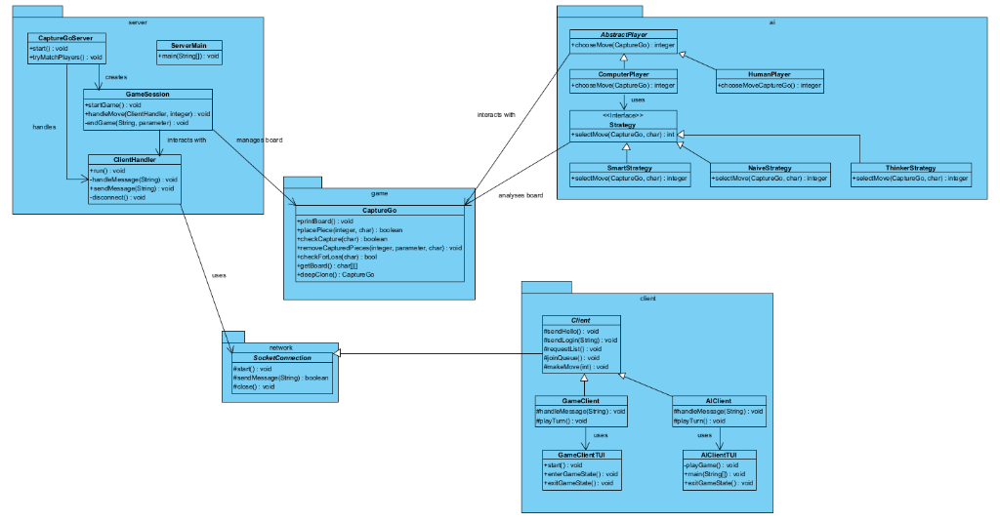
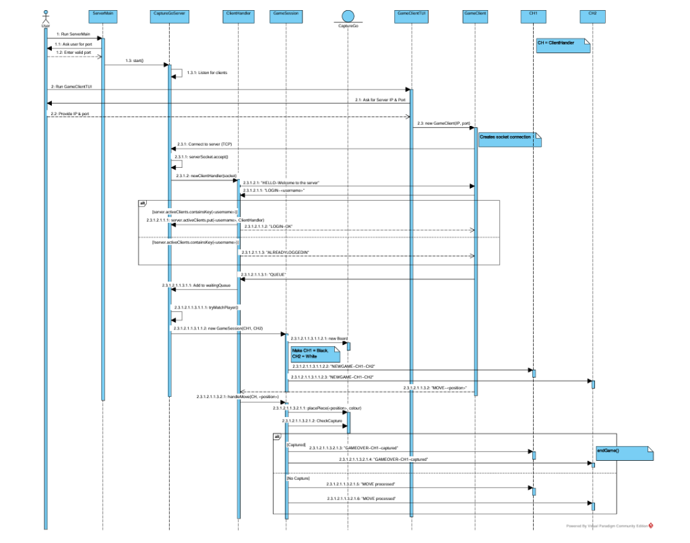
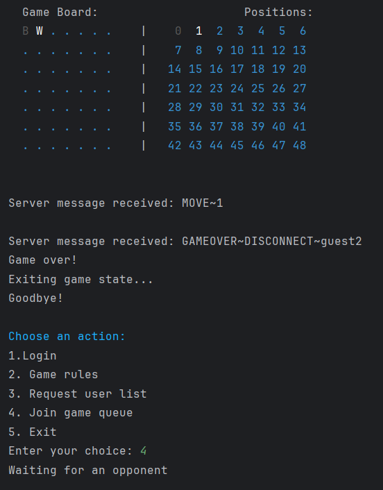

## Project Overview

This project involved the development of a distributed Java application for the board game *Capture Go*. The system allows for networked multiplayer matches as well as single-player games against an integrated AI engine. By applying professional software engineering practices, we built a robust, scalable, and modular system.

## System Architecture & Program Design

The system is designed with a strong emphasis on **Separation of Concerns**, ensuring that each package encapsulates a specific responsibility. The architecture is divided into five core packages: `server`, `client`, `ai`, `network`, and `game`.

### UML Class Diagram

To maintain a clean and modular codebase, the responsibilities are distributed across various components, minimizing tight coupling.

* **Server:** Manages the game sessions (`GameSession`), handles individual client connections (`ClientHandler`), and oversees the matchmaking queue (`CaptureGoServer`).
* **Client:** Facilitates both human (`GameClient`) and AI (`AIClient`) gameplay, inheriting from the base networking classes.
* **Network:** The `SocketConnection` abstract class handles low-level socket communication, preventing code duplication across clients and the server.
* **AI:** Implements player logic through the **Strategy Design Pattern**, allowing dynamic selection between multiple difficulty levels (`NaiveStrategy`, `ThinkerStrategy`, `SmartStrategy`).
* **Game:** The `CaptureGo` class centrally manages the board state, move validation, and game rules, ensuring consistency across the entire system.

### Game Flow & UML Sequence Diagram

The interaction between the server and multiple clients follows a strict protocol to guarantee real-time synchronization and game integrity. The following sequence diagram illustrates the flow from a user starting the server to the completion of a match.

This sequence flow abstracts lower-level networking operations, allowing the server to handle multiple simultaneous sessions through the efficient use of multithreading and synchronization.

## Design Patterns Utilized

To ensure the system remained maintainable and scalable, we applied several established design patterns:

* **Strategy Pattern:** Employed within the AI engine to encapsulate different move-selection algorithms. This allowed us to switch the AI's difficulty (`Naive`, `Thinker`, `Smart`) at runtime without modifying the core `ComputerPlayer` class.
* **Template Method Pattern:** Used in the `SocketConnection` class to define a skeleton for message handling (`receiveMessage()`), allowing subclasses like the Client and Server to implement their specific `handleMessage()` logic while reusing the network loop.

## Gameplay & User Interface

The game can be played via a Text-Based User Interface (TUI), providing a clear representation of the board state, coordinate systems, and real-time server messages.

## Overall Testing Strategy

A rigorous testing methodology was implemented to ensure the stability of the game logic and networking components.

* **Code Coverage:** We achieved a **92% line coverage** metric on the core `CaptureGo` game logic class via extensive unit testing.
* **Test Plan:** The unit tests verified critical functionalities such as:
  * **Move Validation:** Rejecting out-of-bounds placements and occupied spots.
  * **Capture Mechanics:** Ensuring pieces are correctly removed only when all liberties are surrounded.
  * **AI Decision-Making:** Confirming that the AI (`ThinkerStrategy`) consistently identifies winning moves and blocks losing moves.
* **System Tests:** Validated high-level functional requirements, including graceful handling of unexpected client disconnections without crashing the server, supporting multiple concurrent connections, and handling invalid user inputs within the TUI.

## Reflection & Collaboration

The project was executed using Agile methodologies and pair programming. We relied heavily on **Git** for version control, managing merge conflicts, and maintaining a clean shared repository. We also applied the **MVC (Model-View-Controller)** paradigm implicitly by keeping the game logic (`Model`), the TUI (`View`), and the network/client handlers (`Controller`) strictly separated. This experience significantly improved my understanding of multithreaded environments, socket programming, and collaborative software engineering.
