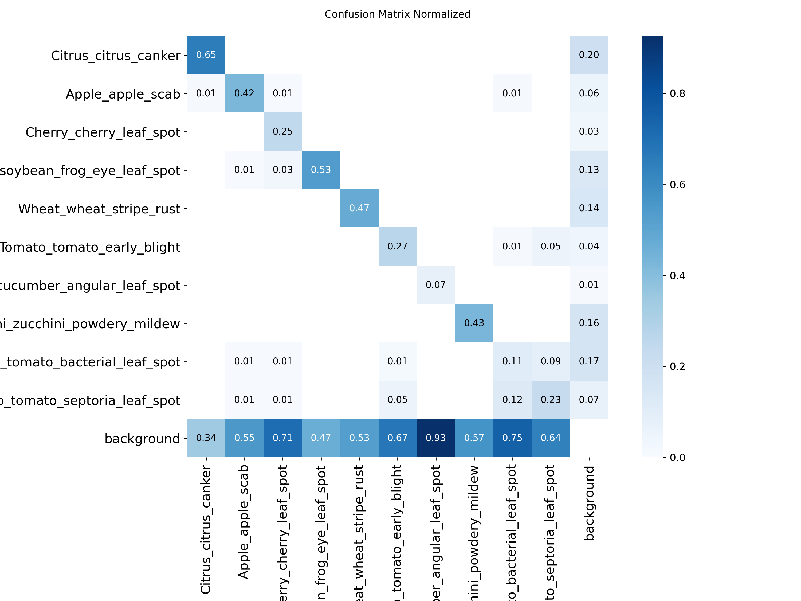
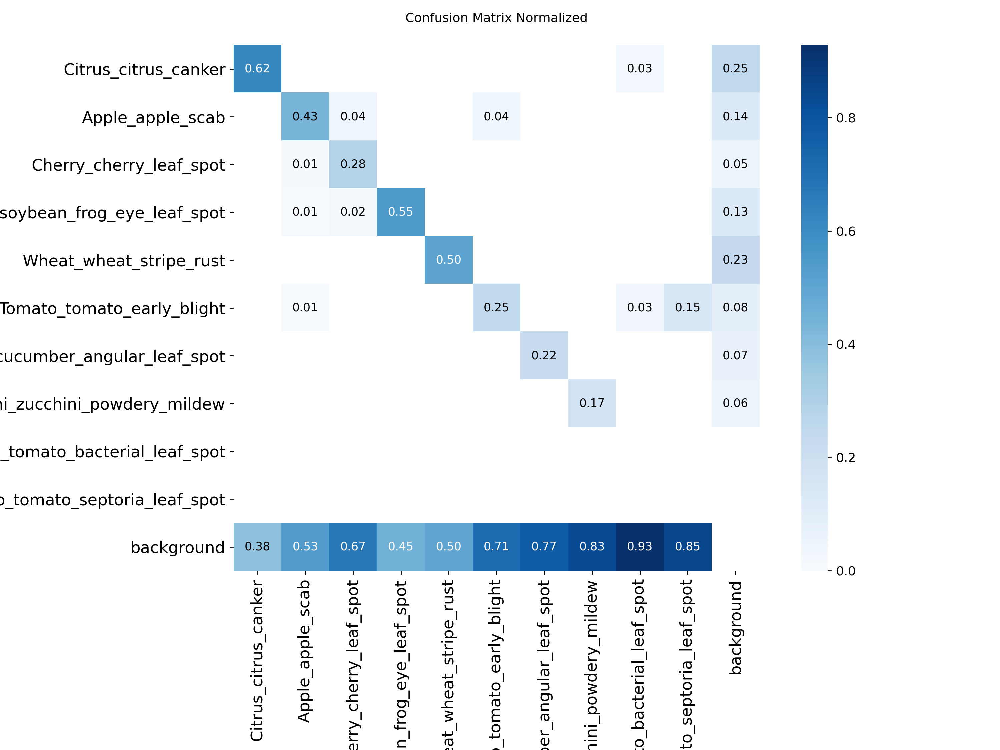
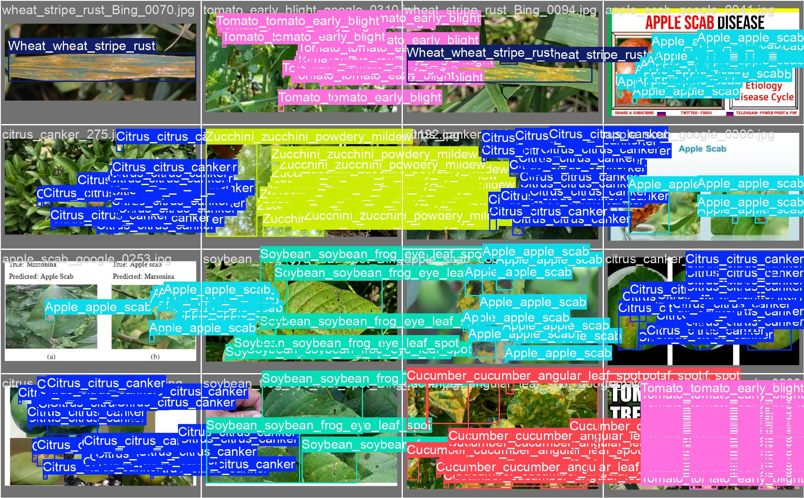
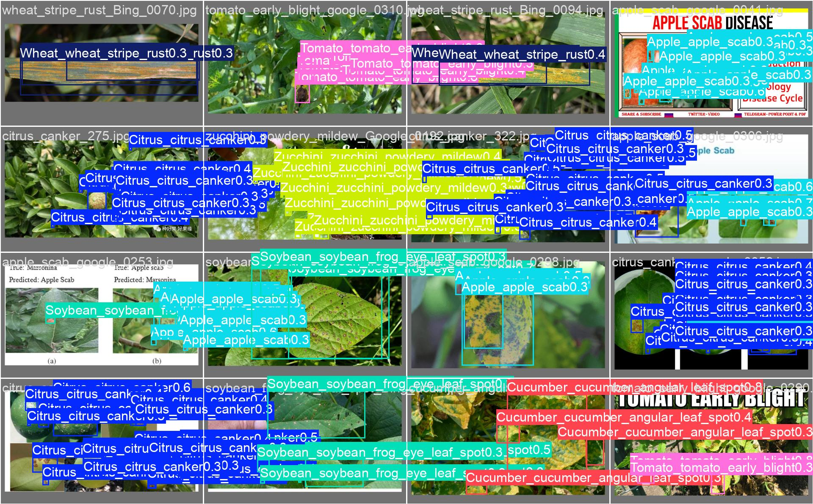

## Project Overview

In agricultural areas with unreliable internet connections, the rapid spread of plant diseases can cause devastating crop yield losses. To address this issue, our team developed an **Intelligent Embedded System** capable of real-time, on-site plant disease diagnostics. By leveraging Edge AI, the system processes camera feeds locally to recognize and classify crop diseases before they can spread, providing farmers with a reliable diagnostic tool to protect their harvests.

## Hardware & System Architecture

The core of our deployment relies on an efficient and powerful edge computing stack:
* **Hardware:** Raspberry Pi 5 paired with a **Hailo AI HAT+ (Hailo-10H NPU)** and a Pi Camera Module 3 for live video input.
* **Software Stack:** Python, OpenCV for image acquisition, and the Hailo SDK for inference execution.

Operating entirely on the edge means the system requires **zero cloud API calls** for inference, reducing latency and completely removing the dependency on external network conditions.

## AI Model Development & Compression Pipeline

The AI pipeline was built with a strong focus on balancing inference accuracy with strict hardware resource constraints, specifically targeting ≥15 FPS real-time performance on edge hardware.

### Initial Training & Pruning
Initially, to manage training time and computational resources effectively, I filtered the original dataset, which was organized in standard COCO format to focus solely on the 10 most frequent plant diseases. I trained a **YOLOv8 Nano** object detection model on this refined dataset. However, running standard models on edge devices often requires optimization. To improve performance on the NPU, I implemented **Structured Pruning**, removing 30% of the convolutional filters to reduce the model's footprint.

### Fine-Tuning & Trade-offs
To recover the accuracy lost during pruning, the model underwent a fine-tuning process enforcing sparsity, utilizing an *Early Stopping* mechanism (patience of 15 epochs) to reach optimal weights around epoch 60.

As expected in model compression, there was a visible accuracy-efficiency trade-off. A comparative analysis of the pre-pruning and post-pruning normalized confusion matrices revealed that while the model became significantly lighter, it completely lost the ability to detect two specific diseases (*Tomato Bacterial Leaf Spot* and *Tomato Septoria Leaf Spot*), which were heavily misclassified as background. 

*Normalized Confusion Matrix before Structured Pruning.*

*Normalized Confusion Matrix after Pruning and Fine-tuning.*

### Final Compilation to HEF
Following the fine-tuning, the PyTorch model was exported to ONNX format. Finally, it was passed through the specific **Hailo Compiler**, which quantized the model to **INT8 precision**, stripped out the redundant zeros generated by the pruning process, and optimized the neural connections into a Hailo Executable Format (HEF). Prior to full deployment, the system required physical calibration directly on the Raspberry Pi using the Pi Camera to account for real-world lighting and hardware variations.

*Training metrics displaying the convergence during the fine-tuning phase (pre-HEF compilation).*

*Visual comparison from the validation phase. Ground truth labels (human-annotated bounding boxes) are contrasted against the AI's predictions to visually identify classification accuracy before edge compilation.*

## Pivot to EfficientNet

While the YOLOv8 pipeline was successfully compressed and deployed, the unacceptable false-negative rate for the two lost tomato disease classes prompted a strategic architectural shift. To meet the project's rigorous reliability needs, we ultimately transitioned the classification engine to an **EfficientNet** architecture. This pivot explored a different model topology which successfully resolved the critical detection blind spots while maintaining the necessary edge performance metrics, showcasing adaptability and a commitment to prioritizing accuracy alongside hardware efficiency.

## Security & Privacy Considerations

Deploying an autonomous device in the field introduces specific vulnerabilities. We conducted a thorough threat analysis and implemented several mitigations:
* **Edge-Based Data Privacy:** All image processing and inference occur locally. No sensitive crop data or telemetry is transmitted externally, preventing data interception.
* **Tamper Prevention:** Local hardware port access (e.g., USB interfaces and SSH configurations) was disabled or heavily restricted to prevent physical tampering by unauthorized third parties.
* **Authorized Diagnostics:** System logs and diagnostic histories are stored locally but placed behind a secure login screen. Access requires a strong, securely hashed password (8+ characters with special symbols), ensuring only authorized personnel can extract operational history.

## Conclusion

This project successfully demonstrated the integration of AI model compression, embedded software engineering, hardware architecture analysis, and robust security practices into a single, cohesive edge device.
