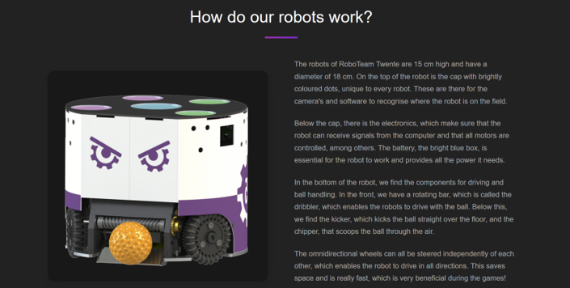

## Project Overview

Development of a custom web platform for the **RoboTeam Twente** association. The project lifecycle was managed under the SCRUM methodology to ensure iterative deliveries aligned with client needs. The prototype heavily focused on robust frontend engineering to deliver a comprehensive public-facing site and a secure administrative dashboard.

## Technical Highlights & Frontend Engineering

* **Vue.js Frontend Development:** Designed and built a dynamic, reactive user interface using the Vue.js framework. Ensured component reusability and a consistent design language across both public pages and the admin dashboard.
* **UI/UX Consistency & State Management:** Implemented streamlined interfaces for managing complex data (events, news, team members, and partners). Ensured high operability and learnability for administrators through standardized CRUD (Create, Read, Update, Delete) views.
* **Session & Security Handling:** Developed logic to handle administrative sessions, including active session polling (checking administrator activity every 10 minutes) and secure credential re-verification for sensitive account changes.
* **Iterative Usability Testing:** Integrated continuous feedback loops from RoboTeam members during sprint reviews. This led to dynamic UI adjustments, such as conditional rendering of empty data fields (e.g., bio boxes), fixing text alignments, and enhancing the visibility of critical components like the Team page.
* **Agile & Version Control:** Active participation in Sprints, Daily Stand-ups, and Code Reviews. Comprehensive source code management and technical collaboration were handled via GitLab.

*Detailed technical overview of the 15cm high, omnidirectional soccer robots developed by RoboTeam Twente.*

---

🏆 **Awarded "Best Project Certificate"** by the EEMCS Faculty (University of Twente) among all participating teams in this module.